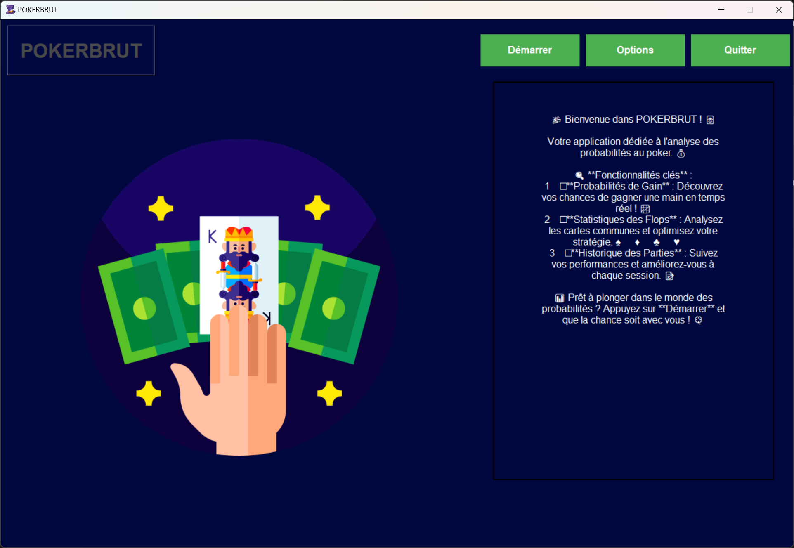

<h1 align="center">🎲 POKERBRUT 🎰</h1>

    <h3>⏳</h3>
    

## 📝 Description
POKERBRUT est une application d'analyse de probabilités pour le poker, développée en Python avec Tkinter. Elle permet aux joueurs d'analyser leurs chances de gagner en temps réel et d'améliorer leur stratégie de jeu.

## ✨ Fonctionnalités

- 📊 Calcul des probabilités de gain en temps réel
- 🃏 Analyse des cartes communes (flop)
- 📈 Suivi des statistiques de jeu
- 📋 Historique des parties
- 🎨 Interface graphique intuitive

## 🛠️ Installation

### Prérequis
- Python 3.8 ou supérieur
- pip (gestionnaire de paquets Python)
- Tkinter (bibliothèque graphique Python)
###
***

# 📸 Aperçu de l'application
<table>
  <tr>
    <td align="center"><b>Vue principale</b></td>
  </tr>
  <tr>
    <td></td>
  </tr>
</table>